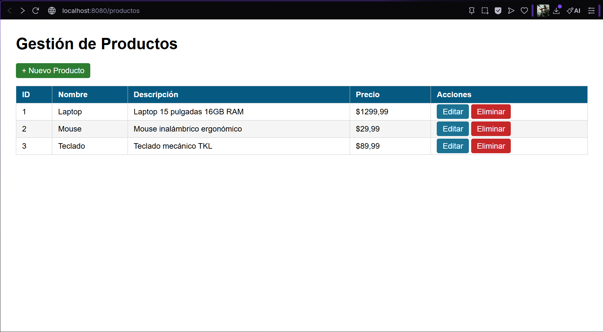
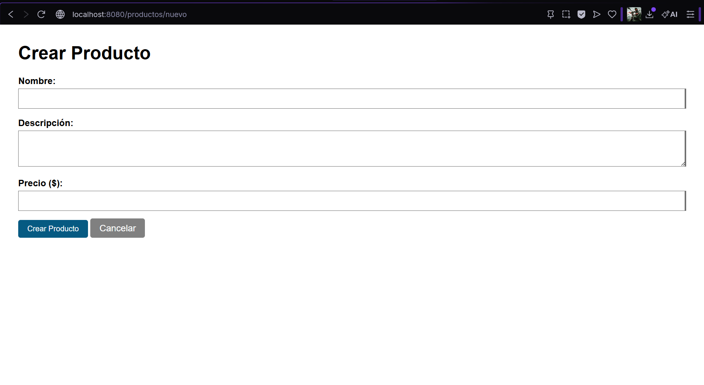
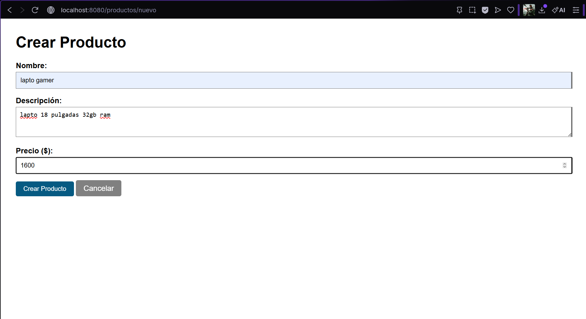
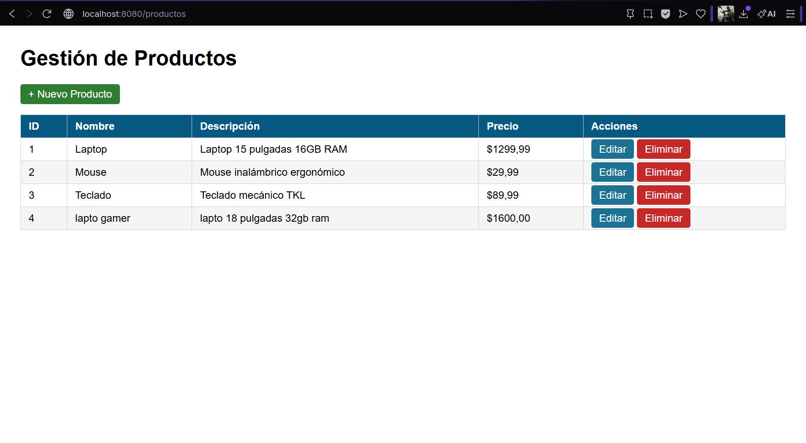
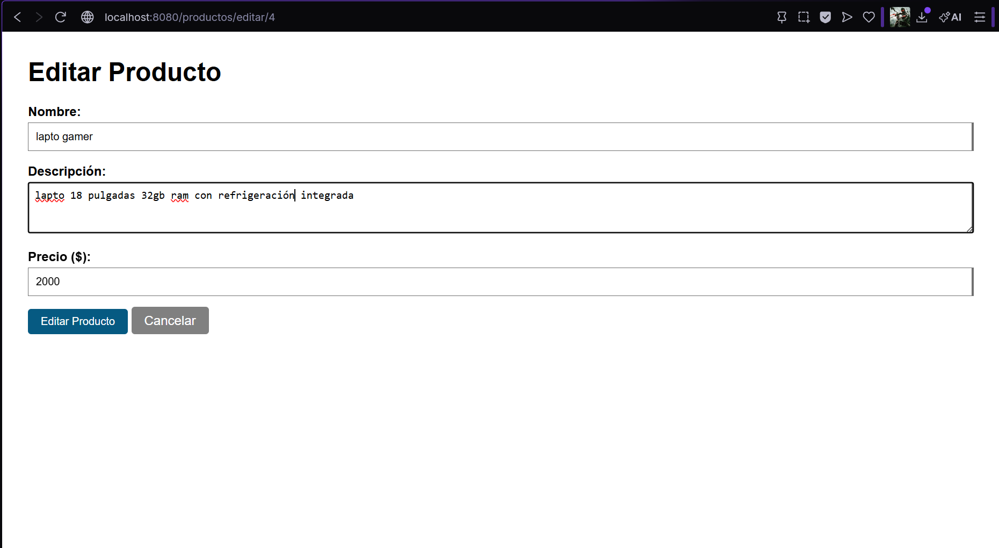
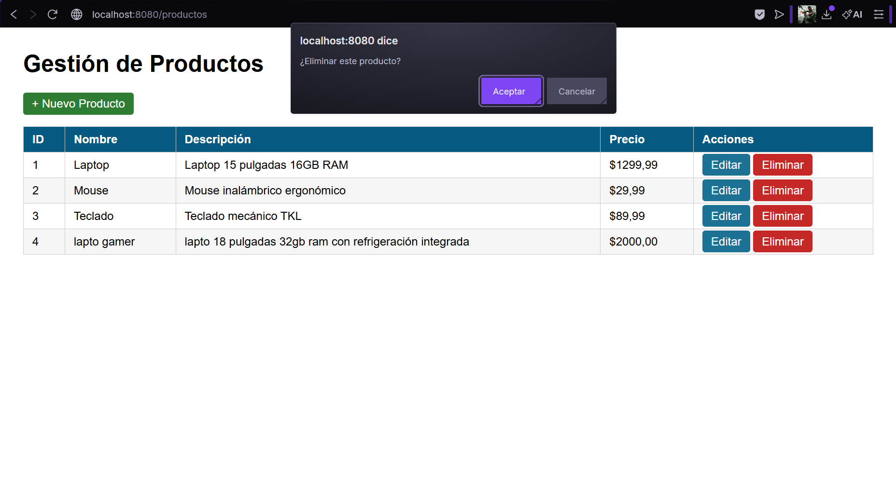

# Gestión de Productos - Spring Boot

Aplicación web CRUD para gestión de productos desarrollada con Spring Boot y Thymeleaf.
Proyecto correspondiente a la Unidad 7 (Post-Contenido 1) de Programación Web - Ingeniería de Sistemas 2026.

## Tecnologías utilizadas

- Java 17
- Spring Boot 3.2.x
- Thymeleaf
- Maven
- Spring Boot DevTools

## Estructura del proyecto

    src/main/java/com/universidad/productosweb/
    ├── model/
    │   └── Producto.java           
    ├── service/
    │   └── ProductoService.java     
    ├── controller/
    │   └── ProductoController.java  
    └── ProductosWebApplication.java 

    src/main/resources/
    ├── templates/productos/
    │   ├── lista.html       
    │   └── formulario.html  
    └── application.properties

## Cómo ejecutar el proyecto

**1. Clonar el repositorio**

    git clone https://github.com/Abrahan07/ProWeb-Remolina-post1-u7.git
    cd ProWeb-Remolina-post1-u7

**2. Ejecutar la aplicación**

    mvn spring-boot:run

**3. Abrir en el navegador**

    http://localhost:8080/productos

> Requiere Java 17 o superior instalado.

## Funcionalidades

| Ruta | Método | Descripción |
|------|--------|-------------|
| `/productos` | GET | Lista todos los productos |
| `/productos/nuevo` | GET | Muestra formulario de creación |
| `/productos/guardar` | POST | Guarda un producto nuevo o editado |
| `/productos/editar/{id}` | GET | Muestra formulario prellenado |
| `/productos/eliminar/{id}` | GET | Elimina un producto |

## Patrón PRG (Post/Redirect/Get)

Las operaciones de escritura (guardar, eliminar) redirigen automáticamente
a la lista después de ejecutarse, evitando el reenvío del formulario al recargar la página.

## Capturas de pantalla

### Lista de productos

### Crear nuevo producto

### Formulario lleno

### Lista actualizada

### Editar producto

### Confirmar eliminación

